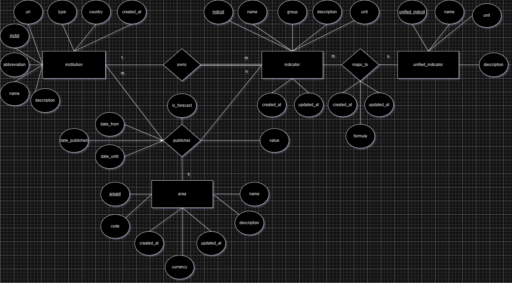
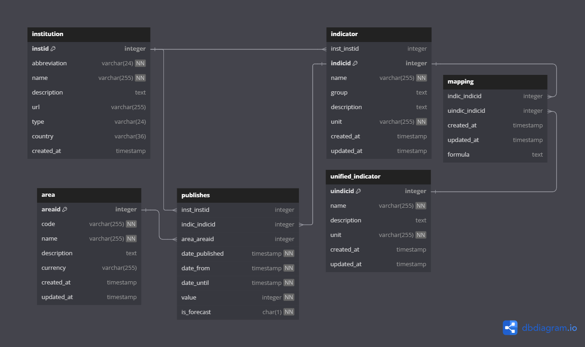

# Financial Forecast Framework

This project showcases an effort to design and develop a framework for managing and analyzing economic projections (such as GDP, headline inflation, etc.) published by financial institutions such as banks and organizations like OECD and IMF. My endeavor to create a system for gathering and organizing data associated with economic indicator forecasts (and real measurements of the indicators) requires segmentation into distinct components, each fulfilling a specific function.

> Data from various sources (projections and real prices) will be extracted and loaded into a database for subsequent analysis.

## Table of Contents

- [Installation](#installation)
- [Usage](#usage)
- [Project Structure](#project-structure)
- [License](#license)
- [Data Model](#Data-Model)

## Installation

1. **Install PostgreSQL**

   - Download and install PostgreSQL from [here](https://www.postgresql.org/download/).
   - During the installation, make sure to note down the username and password you set for the PostgreSQL superuser (default is `postgres`).
2. **Clone the Repository**

   - Open a terminal or command prompt.
   - Navigate to the directory where you want to clone the repository.
   - Run the following command to clone the repository:

     ```sh
     git clone https://github.com/PanagopoulosGeorge/Financial-Forecast-Framework.git
     ```
3. **Create a Virtual Environment**

   - Navigate to the cloned repository directory:

     ```sh
     cd Financial-Forecast-Framework
     ```
   - Create a virtual environment using `virtualenv`:

     ```sh
     virtualenv venv
     ```
   - Activate the virtual environment:
       - On Windows:

         ```sh
         venv\Scripts\activate.bat
         ```
       - On macOS/Linux:

         ```sh
         source venv/bin/activate
         ```
4. **Install Requirements**

   - Install the necessary Python packages using `pip`:

     ```sh
     pip install -r requirements.txt
     ```
5. **Set Up the Database**

   - Execute the scripts in the `install/postgres` folder in the following order to create the database, database user, and grant necessary privileges:
    1. **Create User**:

       - Open the PostgreSQL command line interface (psql) or any PostgreSQL client. If psql command is not recognized, add the bin folder to Path variables (eg. C:\installs\PostgreSQL\16\bin)

         ```sh
         cd install\postgres
         psql -U postgres
         ```
       - Change the password before executing the following script.
       - Run the following command to create a new user:

         ```sql
         \i '1. create_user.sql'
         ```
    2. **Create Database**:

       - Run the following command to create a new database:

         ```sql
         \i '2. create_database.sql'
         ```
    3. **Change user to db owner**:

       - Run the following command after exiting the psql from previous state:

         ```bash
         psql -U db2test -d finforecastdata
         ```
    4. **Create tables**:

       - Run the following command to grant necessary privileges to the user:

         ```sql
         \i '3. create_tables.sql'
         ```
6. **Create configuration .env file**:
7. **Run Migrations**

   - Navigate to the `src` directory after opening a terminal or cmd within Financial-Forecast-Framework folder:

     ```sh
     cd src
     ```
   - Run the following commands to apply migrations and set up the database schema:

     ```sh
     python manage.py makemigrations
     python manage.py migrate
     ```
8. **Import initial institutions, indicators, and geographies.**

   - Navigate to the `src` directory after opening a terminal or cmd within Financial-Forecast-Framework folder:

     ```sh
     python manage.py installation_import_institutions
     python manage.py installation_import_indicators
     python manage.py installation_import_areas
     ```

## Usage

## Project Structure

The system architecture is divided into 3 main components:

##### 1. Database management storage

The system will use **PostgreSQL** as the **database management system** (DBMS) to store financial forecast data. PostgreSQL is chosen for its robustness and scalability as well as Timescale, which is a version of Postgres focused on storing time series data.

##### 2. ETL mechanism

The ETL (Extract, Transform, Load) mechanism will be developed using Django, Requests, and, if needed, Scrapy. These tools allow for effective extraction of financial forecast data from various online sources. Requests is suitable for straightforward HTTP requests for performing API calls, which is most often the case when dealing with financial data, while Scrapy offers a more advanced framework for large-scale, structured data scraping (mainly used for non Javascript rendered pages). The extracted data will be processed and loaded into the PostgreSQL database using Django's ORM capabilities, ensuring seamless integration and data management.

##### 3. User Interface and Visualization Tool (OPTIONAL)

A **Django web application** will serve as the user interface and visualization tool, allowing end users to interact with the stored data. Django is selected due to its ease of integration with databases, built-in admin capabilities, and scalability for web development, ensuring efficient management of the system.

## ER Diagram and Database Entities

Let's start by designing the **ER diagram** for the database. Based on the requirements you've outlined, we can identify three core entities:

### 1. Financial Institutions

These are the entities making predictions or reporting actual measurements for economic indicators.

### 2. Economic Indicators

These are the specific measurements or predictions (e.g., GDP, inflation rate, unemployment rate) made by the institutions. Each indicator will have data for a specific period, with values for both actuals and forecasts.

### 3. Geographical Area

These represent the regions for which the economic indicators are reported or predicted (e.g., countries, states, regions).

## Data Model

Based on the requirements here is a prototype of the ER diagram:



which translates to the following respective relational model:



## License

_MIT License_

Copyright (c) 2024 George Panagopoulos

Permission is hereby granted, free of charge, to any person obtaining a copy of this software and associated documentation files (the "Software"), to deal in the Software without restriction, including without limitation the rights to use, copy, modify, merge, publish, distribute, sublicense, and/or sell copies of the Software, and to permit persons to whom the Software is furnished to do so, subject to the following conditions:

The above copyright notice and this permission notice shall be included in all copies or substantial portions of the Software.

THE SOFTWARE IS PROVIDED "AS IS", WITHOUT WARRANTY OF ANY KIND, EXPRESS OR IMPLIED, INCLUDING BUT NOT LIMITED TO THE WARRANTIES OF MERCHANTABILITY, FITNESS FOR A PARTICULAR PURPOSE, AND NONINFRINGEMENT. IN NO EVENT SHALL THE AUTHORS OR COPYRIGHT HOLDERS BE LIABLE FOR ANY CLAIM, DAMAGES, OR OTHER LIABILITY, WHETHER IN AN ACTION OF CONTRACT, TORT OR OTHERWISE, ARISING FROM, OUT OF, OR IN CONNECTION WITH THE SOFTWARE OR THE USE OR OTHER DEALINGS IN THE SOFTWARE.

## Data Sources

### OECD (API documentation [here](https://gitlab.algobank.oecd.org/public-documentation/dotstat-migration/-/raw/main/OECD_Data_API_documentation.pdf))

The Organization for Economic Cooperation and Development (OECD) provides a wealth of economic data used in this project for financial forecasting. Data such as GDP growth, inflation rates, and employment statistics will be obtained using the \*\*OECD Data API\*\*, which supports RESTful queries in formats like JSON, XML, and CSV.

### IMF (API documentation [here](https://www.imf.org/external/datamapper/api/help))

The International Monetary Fund (IMF)\is another critical data provider. The IMF offers extensive economic data through its \*\*DataMapper API\*\*, enabling retrieval of time-series data related to global economic indicators.